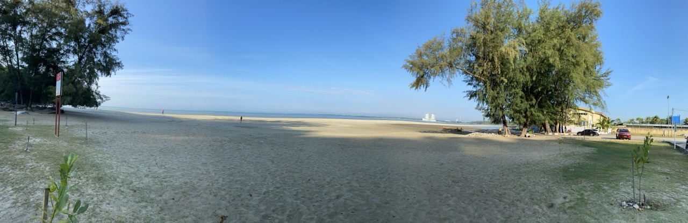
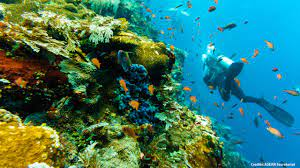

<!DOCTYPE html>
<html lang="en">
<head>
    <meta charset="UTF-8">
    <meta name="viewport" content="width=device-width, initial-scale=1.0">
    <title>Travel Page</title>
    <link rel="stylesheet" href="styles.css">
</head>
<body>
    <!-- Navigation Bar -->
    <nav>
        <ul>
            <li><a href="#home">Home</a></li>
            <li><a href="#about">About Us</a></li>
            <li><a href="#contact">Contact Us</a></li>
            <li><a href="#recommendations">Recommendations</a></li>
        </ul>
    </nav>
  <!-- Home Page -->
    <section id="home">
        <h1>Welcome to the Travel Recommendation Website</h1>
        
Discover your ideal travel destinations with personalized suggestions, engaging content, and detailed information.

    </section>
  <!-- About Us Page -->
    <section id="about">
        <h2>About Us</h2>
        
We are passionate about helping travelers explore the world. Our platform provides interactive displays, detailed descriptions, and multimedia content to enhance your travel planning experience. Unlock the potential of travel with our demographic analysis. We help to craft tailored travel experiences, develop targeted adventure-seeking demographic. From tech-savvy Millennials to experienced baby boomers, join us and elevate your travel experience!

    </section>
  <!-- Contact Us Page -->
    <section id="contact">
        <h2>Contact Us</h2>
        <form id="contact-form">
            <label for="email">Email:</label>
            <input type="email" id="email" name="email" placeholder="Your email" required>
            <label for="message">Message:</label>
            <textarea id="message" name="message" placeholder="Your message" required></textarea>
            <button type="submit">Send</button>
        </form>
    </section>
  <!-- Recommendations Section -->
    <section id="recommendations">
        <h2>Recommendations</h2>
      <!-- Beach Recommendations -->
        

            <h3>Beaches</h3>
            

                
                
            

        

      <!-- Temple Recommendations -->
        

            <h3>Temples</h3>
            

                
                
            

        

      <!-- Recommendations by Country -->
        

            <h3>Destinations by Country</h3>
            

                
                
            

        

    </section>

</body>
</html>
